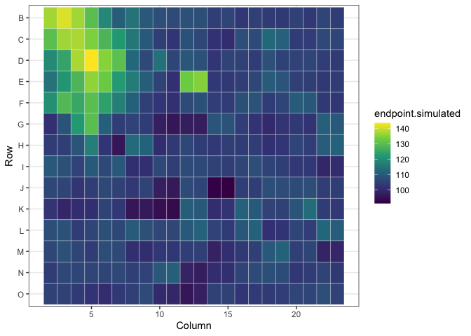

<!-- README.md is generated from README.Rmd. Please edit that file -->

# arrayedCRISPRscreener

<!-- badges: start -->
<!-- badges: end -->

The goal of arrayedCRISPRscreener is to simulate arrayed CRISPR
screening data for the purpose of benchmarking data analysis tools as
well as power calculation.

## Installation

You can install arrayedCRISPRscreener from
[GitHub](https://github.com/AstraZeneca/arrayedCRISPRscreener) with:

``` r
# install.packages("devtools")
# devtools::install("arrayedCRISPRscreener")
```

## Quick start

``` r
library(arrayedCRISPRscreener)
library(ggplot2)
```

The simulation is designed to run based on a platemap layout. The
following are the most basic steps for simulating arrayedCRISPR data
using the platemap design. Please note that an example platemap is
included in the package. To perform a simulation, users must specify
parameters that correspond to various experimental factors. For example,
we demonstrate a simulation that only includes the gKO effect, without
any additional treatments.

``` r
## data frame of platemap layout
plate_layout <- platemap # example platemap design
head(plate_layout)
#> # A tibble: 6 × 4
#>   Row   Column  gene compound
#>   <chr>  <dbl> <int>    <int>
#> 1 B          2    NA        2
#> 2 B          3    NA        1
#> 3 B          4    59        2
#> 4 B          5    59        1
#> 5 B          6    60        2
#> 6 B          7    60        1

## Number of randomly selected wells with phenotypic effect due to gKO
n_hit <- 10

## Number of gKO treatment interacting phenotypic effect with other treatment.
## In this example, we assume there is no additional treatment in the assay
n_hit_with_interaction <- 0

## Numeric value desired number of cells per well
desired_cells_per_well <- 1000

## Numeric value baseline endpoint value due to gKO
base_level <- log(100)

## variation among the negative genes
sigma_bg0 <- 0.05

## Average gKO effect size as percentage based on the baseline endpoint value
mu_bg <- 0.2

## Variation of gKO effect
sigma_bg <- 0.05

## Average effect size of interaction between gKO and other stimulated
## treatment as percentage based on the baseline endpoint value
mu_btg <- 0

## Variation of interaction effect
sigma_btg <- 0

## Coefficient of variation (sig/mu) for the variation between cells within well
cv_cell <- 0.05

## Measurement error in log scale
measure_error <- 0.3

## Spatial bias can be included in the simulated data. Example input for
## spatial biased is included in the package as follow,
head(wells_with_spatial_bias)
#> # A tibble: 6 × 3
#>   Column Row   spatial_bias
#>    <dbl> <chr>        <dbl>
#> 1      2 B              150
#> 2      2 C              120
#> 3      2 D               90
#> 4      2 E               60
#> 5      2 F               30
#> 6      3 B              180

## Data frame specifying the systematic spatial bias
wells_with_spatial_bias$spatial_bias <-
  0.2 * wells_with_spatial_bias$spatial_bias
summary(wells_with_spatial_bias$spatial_bias)
#>    Min. 1st Qu.  Median    Mean 3rd Qu.    Max. 
#>    6.00   12.00   18.00   17.88   24.00   36.00

## Simulation for single plate
sdata <- sim_single_plate(platemap,
                          n_hit,
                          n_hit_with_interaction,
                          desired_cells_per_well,
                          base_level,
                          mu_bg,
                          sigma_bg,
                          mu_btg,
                          sigma_btg,
                          cv_cell,
                          measure_error,
                          wells_with_spatial_bias,
                          sigma_bg0)

head(as.data.frame(sdata))
#>   Row Column gene compound hit hit_with_interaction       a            bg btg
#> 1   B      2   NA        2   0                    0 4.60517  0.0000000000   0
#> 2   B      3   NA        1   0                    0 4.60517  0.0000000000   0
#> 3   B      4   59        2   0                    0 4.60517 -0.0003190263   0
#> 4   B      5   59        1   0                    0 4.60517 -0.0003190263   0
#> 5   B      6   60        2   0                    0 4.60517 -0.0543497494   0
#> 6   B      7   60        1   0                    0 4.60517 -0.0543497494   0
#>   bt n_cells spatial_bias y_all_cells        y
#> 1  0    1020           30    139915.6 137.1722
#> 2  0    1038           36    146697.5 141.3270
#> 3  0     981           30    134315.8 136.9172
#> 4  0    1002           24    130295.4 130.0353
#> 5  0    1003           18    119306.0 118.9491
#> 6  0    1037           12    114762.4 110.6677
```

We can visualized the simulated arrayed CRISPR screen data based on a
384 well-plate in a heatmap.

``` r
p <- ggplot(sdata, aes(x = Column, y = Row)) +
            geom_tile(aes(fill = y), color = "white") +
            scale_y_discrete(limits = rev(unique(sdata$Row))) +
            scale_fill_continuous(type = "viridis") +
            labs(fill = "endpoint.simulated") + theme_bw()

print(p)
```


