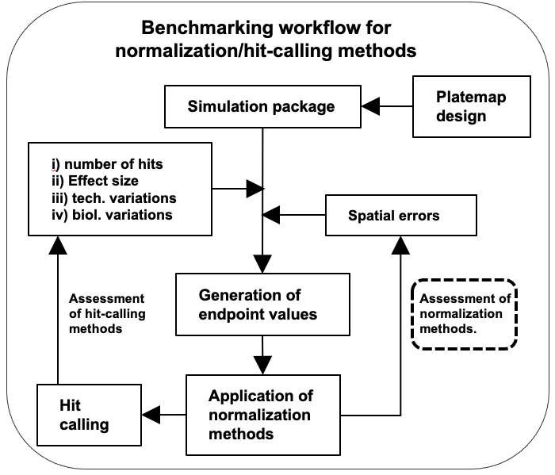
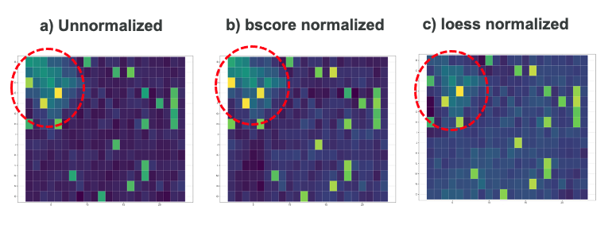
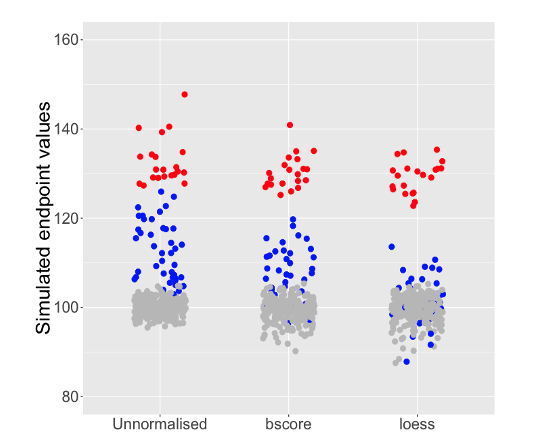

```{r, include = FALSE}
knitr::opts_chunk$set(
  collapse = TRUE,
  comment = "#>"
)


library(arrayedCRISPRscreener)
```


## Abstract

There are many methods for arrayed CRISPR screening data analysis. 
However, it is often unclear what is the best choice and what caveats. 
This is because each arrayed CRISPR screen campaign has a unique assay design that requires a tailored analysis strategy based on its biological hypothesis’s scope. 
To guide the choice, we developed a statistical simulation model, which mimics the process of data generation for the arrayed CRISPR screening experiment. 
It is flexible to use and able to simulate various experiment factors such as effect sizes, different biological and technical variability that can affect phenotypic effects. 
With this simulation model, we benchmarked methods for hit calling for various assay designs from previous arrayed CRISPR campaigns. 
This simulation model is implemented in a R package, arrayedCRISPRscreener, and will be used to establish toolkits for power calculation of downstream analysis for future arrayed CRISPR screen.

## Introduction

Clustered Regularly Interspaced Short Palindromic Repeats (CRISPR) and the CRISPR-associated (Cas) proteins have revolutionized genetic perturbation studies by enabling genome-wide investigations. 
In CRISPR screens, cells with edited genes are subjected to selective pressure, such as drug treatment, to identify genes that sensitize or confer an advantage to cells under the disease condition. 
Arrayed CRISPR screens [@kim:2018arrayedCRISPR; @Groot:2018arrayedCRISPR] are primarily used for validation and follow-up investigations, which involve applying a gene knockout (gKO) within a single well, making it possible to combine CRISPR screens with complex functional assays. 
High-content imaging is a popular screening approach, which provides endpoint readouts at the single-cell level using multiple phenotypic molecular markers, depending on the biological hypothesis of interest.
These screens involve introducing different genetic perturbations and drug treatments to cells in different wells of a plate, and the readouts are obtained through imaging analysis. 
Despite their growing importance, there is currently little guidance on how to design and analyze arrayed CRISPR screens. 
While efforts have been made for pooled CRISPR screens, the need for guidance on arrayed CRISPR screens remains unmet [@Bodapati:2020tv]. 

To fill the gap, we developed a simulation model that aims to optimize the experimental design and evaluate the downstream data analysis methods.  
To account for the intricate assay design of the arrayed CRISPR screen experiment, we utilized a Bayesian hierarchical modeling framework [@Zhang:2021Bayesian].

By using this framework, we can ensure that the experiment is conducted in a way that maximizes the quality and reliability of the results. 
Moreover, the simulation allows us to assess the performance of the analysis pipelines, enabling us to choose the most appropriate method for the given data set.

## Methods

### Bayesian hiearchical simulation model

The simulation model is inspired by how arrayed CRISPR data are generated in practice. 
In short, the direct measurement is on the expression value of a specific marker (for example P21) in a single cell from a well. 
However, the image analysis software will summarize all the single cell values into a average (either median or average) for a single well and it is those average values will be used for the downstream analysis. 

To mimic the process as close as possible, our simulation model simulates the single cell level expression level based on true gene editing effect (gKO), treatment effect ($\beta_T$) as well as their interaction ($\beta_{TG}$). 
Since in a plate, there are a large number of cells in a well and about 100 genes targeting the same biological pathway, our simulation model contains a  hierarchical structure which allows us to account for between gene as well as between cell variability.     

$$
\begin{align}
y[\text{row}[i],\text{column}[i]] &= \frac{\sum_{j=1}^{\text{N}_\text{cell}}y_\text{per cell}[\text{row}[i],\text{column}[i], \text{cell}[j]]}{\text{N}_\text{cell}[\text{row}[i],\text{column}[i]]} \\
\\
y_\text{per cell}[\text{row}[i],\text{column}[i]][j] &\sim \text{Lognormal}(z_\text{per cell}[\text{row}[i],\text{column}[i]][j],\sigma) \\
\\
exp(z_\text{per cell}[\text{row}[i],\text{column}[i]][j]) &= x_\text{per cell}[\text{row}[i],\text{column}[i]][j] + \text{spatial bias}[\text{row}[i],\text{column}[i]])) \\
\\
x_\text{per cell}[\text{row}[i],\text{column}[i]][j] &\sim \text{Normal}(\mu_\text{per cell}[\text{row}[i],\text{column}[i]],\sigma_\text{cell}) \\
\\
log(\mu_\text{per cell}[\text{row}[i],\text{column}[i]]) &= \alpha + \beta_G[\text{gene}[i]] \text{G}[\text{row}[i],\text{column}[i]] + (\beta_T + \beta_{TG}[\text{gene}[i]] \text{G}[\text{row}[i],\text{column}[i]]) \text{T}[\text{row}[i],\text{column}[i]] \\
\\
\beta_{G}[k] &= (1 - \theta[k]) 0 + \theta[k] \text{Normal}(\mu_{\beta_G}, \sigma_{\beta_G}) \\
\\
\beta_{TG}[k] &= (1 - \theta[k]) 0 + \theta[k] \text{Normal}(\mu_{\beta_{TG}}, \sigma_{\beta_{TG}})
\end{align}
$$

The simulated arrayed CRISPR data are organized so that each row represents a cell in a particular well. 
In the same data, the parameters underlying the simulations are also included and explained below. 

$$
\begin{align}
\text{The notation of equations is as follow:} \\
\\
\text{i} &= \text{well index within a plate} \\
\text{j} &= \text{cell index within a well} \\
\text{k} &= \text{index for edited gene} \\
\text{row}[i] &= \text{row id in the plate} \\
\text{column}[i] &= \text{column id in the plate} \\
\text{cell}[j] &= \text{index for cell in a well} \\
\text{N}_\text{cell} &= \text{total number of cells in a well} \\
y[ ] &= \text{observed mean endpoint value of a well} \\
y_\text{per cell}[ ] &= \text{observed endpoint value of single cells in a well} \\
z_\text{per cell}[ ] &= \text{log-scale of endpoint value of single cells in a well} \\ 
\sigma &= \text{technical bias (e.g., optical measurement error)} \\
x_\text{per cell}[ ] &= \text{true endpoint value of single cells in a well without spatial bias} \\
\text{spatial bias}[ ] &= \text{spatial bias value in the well} \\
\sigma_\text{cell} &= \text{between cell variability within a well} \\
\mu_\text{per cell} &= \text{average true endpoint value of a single cell within a well} \\
\alpha &= \text{base level of endpoint value} \\
\beta_\text{G} &= \text{gKO effect size} \\
\beta_\text{T} &= \text{Treatment effect size} \\
\beta_\text{TG} &= \text{interaction effect size between gKO and Treatment} \\
\text{gene}[i] &= \text{gene an index vector of length equaling to the number of wells in the plate, the element of this vector can have a value between 1 and k} \\
\text{G}[] &= \text{indicator whether gKO is present or not (1 or 0)} \\
\text{T}[] &= \text{indicator whether Treatment is present or not (1 or 0)} \\
\theta[k] &= \text{indicator whether a gene is a hit or not} \\
\mu_{\beta_\text{G}} &= \text{average gKO effect size} \\
\sigma_{\beta_\text{G}} &= \text{biological variance of gKO effect} \\
\mu_{\beta_\text{TG}} &= \text{average interaction between treatment and gKO} \\
\sigma_{\beta_\text{TG}} &= \text{biological variance of interaction between treatment and gKO}

\end{align}
$$

## Quick start

The simulation is designed to run based on a platemap layout. 
The following are the most basic steps for simulating arrayedCRISPR data using the platemap design. 
Please note that an example platemap is included in the package. 
To perform a simulation, users must specify parameters that correspond to various experimental factors. 
For example, we demonstrate a simulation that only includes the gKO effect, without any additional treatments.


```{r}
## data frame of platemap layout
plate_layout <- platemap # example platemap design
head(plate_layout)

## Number of randomly selected wells with phenotypic effect due to gKO
n_hit <- 10

## Number of gKO treatment interacting phenotypic effect with other treatment.
## In this example, we assume there is no additional treatment in the assay
n_hit_with_interaction <- 0

## Numeric value desired number of cells per well
desired_cells_per_well <- 1000

## Numeric value baseline endpoint value due to gKO
base_level <- log(100)

## variation among the negative genes
sigma_bg0 <- 0.05

## Average gKO effect size as percentage based on the baseline endpoint value
mu_bg <- 0.2

## Variation of gKO effect
sigma_bg <- 0.05

## Average effect size of interaction between gKO and other stimulated
## treatment as percentage based on the baseline endpoint value
mu_btg <- 0

## Variation of interaction effect
sigma_btg <- 0

## Coefficient of variation (sig/mu) for the variation between cells within well
cv_cell <- 0.05

## Measurement error in log scale
measure_error <- 0.3

## Spatial bias can be included in the simulated data. Example input for
## spatial biased is included in the package as follow,
head(wells_with_spatial_bias)

## Data frame specifying the systematic spatial bias
wells_with_spatial_bias$spatial_bias <-
  0.2 * wells_with_spatial_bias$spatial_bias
summary(wells_with_spatial_bias$spatial_bias)

## Simulation for single plate
sdata <- sim_single_plate(platemap,
                          n_hit,
                          n_hit_with_interaction,
                          desired_cells_per_well,
                          base_level,
                          mu_bg,
                          sigma_bg,
                          mu_btg,
                          sigma_btg,
                          cv_cell,
                          measure_error,
                          wells_with_spatial_bias,
                          sigma_bg0)

head(as.data.frame(sdata))
```

## Benchmarking

This simulation package offers great flexibility in exploring various experimental factors, including effect sizes and different sources of biological and technical variability. It allows users to perform benchmarking of various normalization and hit-calling tools, enabling the identification of an optimized data analysis strategy, including statistical power analysis.

```{r, echo=FALSE, out.width = '80%'}

```

## An application for benchmarking of spatial normlisation method

Here we present the benchmarking results for two spatial normalization methods: B-score and Loess. To conduct this study, we simulated data for a plate with 384 wells, where we randomly selected 10% of the wells as having phenotypic changes with an effect size of approximately 30%. In Figure (a) below, we present a heatmap visualization of the simulated data. We introduced a "bell-shaped" spatial bias at the top left corner of the plate, which is indicated by the red-colored circle in the figure.
<br><br>
In Figures (b) and (c), we present the results of these two methods visually. The normalization outcomes show a considerable reduction in spatial bias after applying the B-score and Loess methods.
<br><br>
```{r, echo=FALSE, out.width = '80%'}

```

The result of this experiment reveals that the Loess method is more effective than the B-score method in normalizing the example spatial bias (of interests as described as "bell-shaped" bias) based on the simulated data. The results are presented in detail in the figure below.
<br><br>
In this figure, each dot represents the endpoint value for each well. The red dots indicate the readout values with significant phenotypic changes (~30% effect size), while the blue dots represent the values with spatial errors. The grey dots represent the values with no effects or systemic spatial artifacts. Based on our analysis, the Loess method showed a more significant reduction in spatial bias of interests compared to the B-score method. 
<br><br>
```{r, echo=FALSE, out.width = '80%'}

```


## Reference

